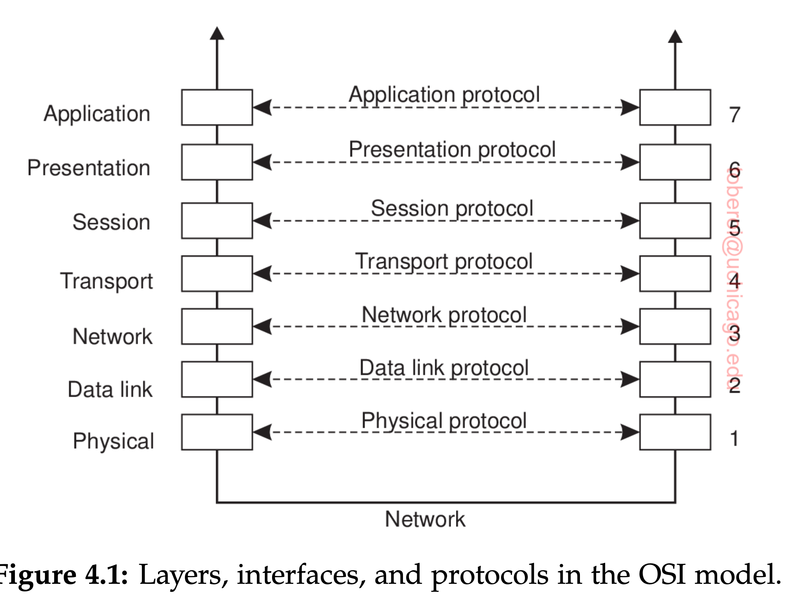
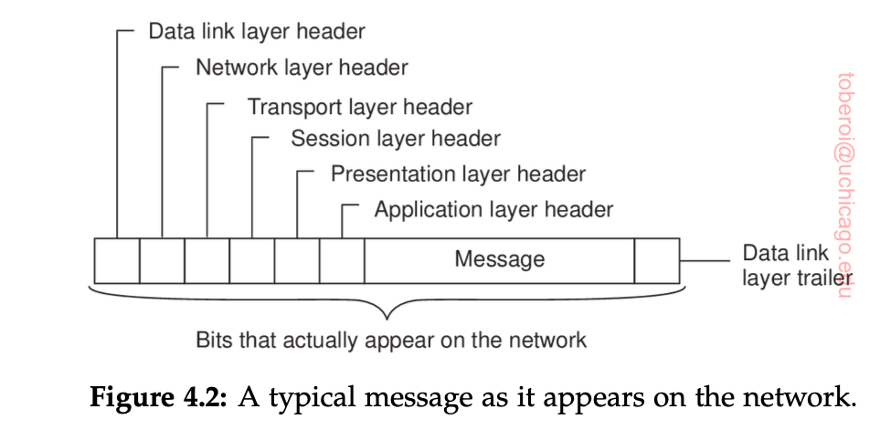
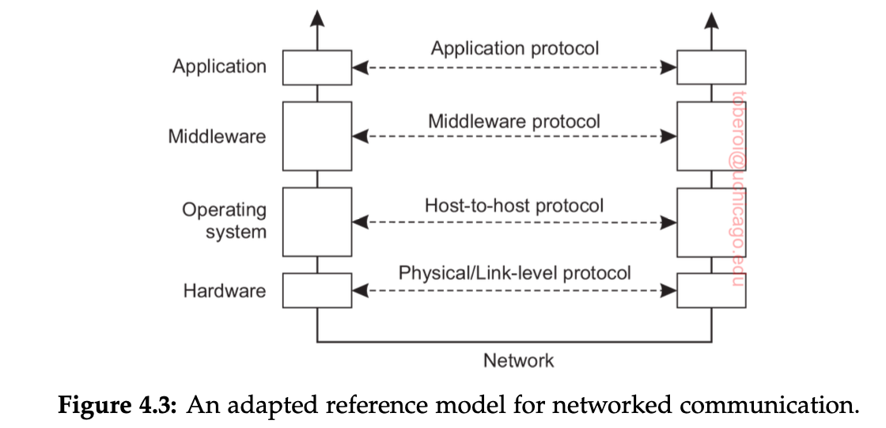

# Communication

What are we talking about ?

- Communication in distributed systems has traditionally always been based on low level message passing, offered by underlying network. Message passing communication is harder than shared memory communication in non distributed platforms.
- Modern distributed sytems consists of millions of processes scattered across network with unreliable communication such as the Internet. Unless the old communciation facilities of networks is replaced developing large scale distributed applications is very difficult.
- Discussion involved: 
<ol>
    <ul> Protocols (rules that communicating processes must adhere to) </ul>
    <ul> Structuring of these protocols </ul>
    <ul> Famous model of communication - RPC and MOM </ul>
    <ul> Problems of Multicasting </ul>
</ol>

Issue related to Communication

Intro to Layered Protocols: Due to absence of shared memory we rely on low-level (sending and recieving messages) communciations in distributed systems.

Thats is when P wants to communicate to Q, P will create a message in its own address space. Then executes a system call so that OS sends the message via network to Q. 
Simple? No cause P and Q have to agree on the meaning of bits being sent.

Solution?
To deal with issues on levels and communication - OSI model

`All People Seem to Need Data Processing`

Purpose of OSI?

Allow open systems (one that is prepared to communicate with other open systems using standard policies on format, content and meaning of messages sent and recievd) to communicate. 

Such protocols = `communication protocols`. These protocols provide  `communication service ` Two types of services 
<ol>
    <ul>connection-oriented service: Establish a connection and negotiate on specific params to use and then exchange data. Eg: Telephone</ul>
    <ul>connectionless: no setup required in advance. Sender transmits the first message when ready. Eg: Dropping letter in mailbox</ul>
</ol>
With computers both connections are common.

With OSI communication is didvided into layers, each layer responsible for communication service for specific layer above it. Each layer provides an `interface` to the one above it. This interface consists of operations, that define the service tha layer is prepared to offer. 

Layers:

<ol>
    <ul>Physical Layer: How 2 computers connected and how 0s and 1s are represneted.</ul>
    <ul>Data Link Layer: detect and possibly correct transmission errors + protocols to keep sender and receiver in same pace. </ul>
    <ul>Network Layer: protocols for routing message through computer network + protocols for handling congestion </ul>
    <ul>Transport Layer: protocols for supporting applications that establish reliable communication</ul>
    <ul>Session Layer: support for session b/w applications </ul>
    <ul>Presenatation Layer: prescibes how data is represented independent of hosts running the application. </ul>
    <ul>Application Layer: email protocols/Web access protocols/ file transfer protocols.</ul>
</ol>

<ol> P wantes to communicate to Q
    <ul> P builds message passes to application layer as offered to it by means of interface (usually in terms of library procedure)
    </ul>
    <ul> Application layer adds header to fromt of message and passes the resulting message to presentation layer.
    </ul>
    <ul>Presentation layer adds its own header and passes to session layer and sp on</ul>
    <ul>Data link layer add header + trailer to end. </ul>
    <ul>When reaches physical layer this actually transmits message by putting it in physical tranmission medium. </ul>
    <ul>Once message reached Q, message is passed to each layer, with each layer stripping off its header. </ul>
    <ul> Message finally reaches the reciever Q which can then reply the similar path</ul>

</ol>

More discussion about OSI layers:

- `Physical layer` concerned about transmitting 0 and 1 (what volts to use, homw many bits per sec to send, whether transmission can take simulataneously.) Many physical standards eg: USB for serial communication. 
- This layer is just concerned about sending bits, but who makes sure that no error occurs in this data - Data Link Layer. `Data Link layers` groups the bits into units. But How?
- Data link layer does it by putting a special bit pattern on start and end of each frame, to mark them and computing `checksum`. The data link layer appends this checksum to frame and. When data received the checksum is calculated again to validate data.
- How message reaches sender? In LAN the message is just put to network and picked up by reciever. But what about WAN, the message has to make number of hops -> to choose best path `routing`. Primary task of `network layer``.
- In this, shortest route not always best route. What matters in amount of delay on a route (decide by traffic, no of messages queued up). Some routing algo adapt to changing loads whereas some make decision based on long time avg. 
- Most widely used netowork protocol `IP`. And `IP` packet (message in network layer) can be sent without setup. routed to destination independent of all others.
- `Transport layer` turns the underlying network into something the application can use. Application layer send message to transport layer with an expectation that it will be sent without any loss.
-  Transport layer breaks it into small pieces, assign each one a sequence number and then sends them. The header f=of transport layer includes which packets sent/received, room to accept more packets etc.
-  Reliable transport connections can be connection oriented (packets arrive in order) or connectionless (order can change). Its on transport layer to maintain order for an illusion of packets transmitted in order.
-  Internet transport protocol - TCP (Transmission Control Protocol). The user programs that dont need connection oriented protocol use UDP.
-  Alternative to TCP (moves bytes b/w processors) suggested is SCTP (groups data into messages)
-  `Session` layer provides dialog control, which party is talking + provides syncronisation facilities (for checkpoints in long transfers)
-  `Presentation` layer concerns with meaning of bits. Usually messages arent random bit strings but a structured object. This defines records and notify receiver that this is the format object of data.

Drwaback of OSI:
No clear disrinction b/w application and application specific protocols.

Eg: Application specific protocl HTTP is protocol designed to remotely manage and handle transfer of Web pages. HTPP is also used by systems not ties to Web like java object's invocation can use HTTP to request invocation of remote objects protected by firewall.

Solution?

Middleware protocols

Middleware applications logically lives in OSI application layer but are more general purpose.
<ol> Eg:
    <ul>DNS: domain name look up. Application layer logically but offfering general purpose application-independent service.</ul>
    <ul>Authentication protocols are closely tied to specific applications but instead integrated to middleware as general service.</ul>
    <ul> Remote procedure call</ul>
    <ul></ul>
</ol>

